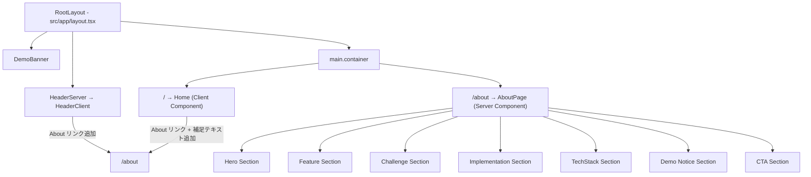
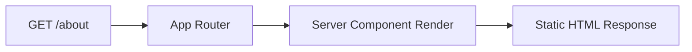

# Design Document — About Page

## Overview

本設計は、ポートフォリオ閲覧者向けのサービス説明ページ (`/about`) を QuickLabel アプリケーションに追加するためのものである。
既存の Next.js App Router 構造に従い、Server Component として静的にレンダリングされるページを新規作成し、
ヘッダーナビゲーションおよびトップページから `/about` への導線を追加する。

主な変更対象:
- **新規**: `src/app/about/page.tsx` — About ページ本体（Server Component）
- **修正**: `src/components/header/HeaderClient.tsx` — About リンク追加
- **修正**: `src/app/page.tsx` — 補足テキストと About リンク追加（QuoteFormComponent 呼び出し前）

設計方針:
- 新規依存パッケージは追加しない（`lucide-react`, `shadcn/ui` 等すべて既存）
- Server Component として実装し、`"use client"` は使用しない
- 既存 UI コンポーネント（Card, Button, Badge）を再利用
- 既存のカラースキーム（purple-900 ヘッダー、amber DemoBanner）と一貫性を保つ

## Architecture

### ページ構造



### ファイル変更マップ

```
src/
├── app/
│   ├── about/
│   │   └── page.tsx          ← 新規作成（Server Component）
│   ├── page.tsx              ← 修正（About リンク + 補足テキスト追加）
│   └── layout.tsx            ← 変更なし
├── components/
│   ├── header/
│   │   ├── HeaderClient.tsx  ← 修正（About リンク追加）
│   │   └── HeaderServer.tsx  ← 変更なし
│   └── ui/
│       ├── card.tsx          ← 変更なし（再利用）
│       ├── button.tsx        ← 変更なし（再利用）
│       └── badge.tsx         ← 変更なし（再利用）
```

### データフロー

About ページは完全な静的コンテンツで構成される。認証状態・API 通信・クライアントサイド状態管理は不要。



## Components and Interfaces

### 1. AboutPage (`src/app/about/page.tsx`)

Server Component。全セクションを単一ファイルで実装する。

```typescript
// src/app/about/page.tsx
import { Metadata } from 'next'
import Link from 'next/link'
import { Card, CardHeader, CardContent, CardTitle } from '@/components/ui/card'
import { Button } from '@/components/ui/button'
import { Badge } from '@/components/ui/badge'
import {
  Truck, FileText, CreditCard, ClipboardList, MapPin,
  AlertTriangle
} from 'lucide-react'

export const metadata: Metadata = {
  title: 'QuickLabel — サービス説明',
  description:
    'QuickLabel は配送見積もり・ラベル発行・決済を一体化した業務支援 Web アプリケーションです。',
}
```

セクション構成:

| セクション | 要素 | 使用コンポーネント |
|---|---|---|
| Hero | サービス名 (h1)、一文説明 (p)、デモ注意 (div) | Tailwind のみ |
| Feature | 5 機能カード (grid) | Card, CardHeader, CardContent, CardTitle + lucide icons |
| Challenge | 課題リスト | Card |
| Implementation | 実装ポイント 4 項目 | Card, CardContent |
| TechStack | カテゴリ別バッジ一覧 | Badge |
| Demo Notice | デモ制約一覧 | div (amber color scheme) |
| CTA | 見積画面へ / トップへ戻る | Button + Link |

### 2. HeaderClient 修正 (`src/components/header/HeaderClient.tsx`)

About リンクを認証リンクの**前**に配置する。認証状態に関係なく全ユーザーに表示する。

```typescript
// 現在の nav > div 内に、認証ブロックの前に追加
<Link 
  href="/about" 
  className="text-white hover:opacity-80 transition-opacity"
>
  サービス説明
</Link>
```

配置ルール:
- デスクトップ: `flex items-center space-x-3 md:space-x-8` 内の最初のリンクとして
- モバイル: 同じ `div` 内に配置（既存のレスポンシブ設計が適用される）

### 3. Top Page 修正 (`src/app/page.tsx`)

`Home` コンポーネントの return 内、`QuoteFormComponent` の**前**に補足テキストと About リンクを追加する。

```typescript
// QuoteFormComponent の前に挿入
<div className="max-w-6xl mx-auto">
  {/* 補足テキスト — h1 の直下に相当する位置 */}
  <p className="text-sm text-gray-500 text-center mb-2">
    FedEx API を用いた配送業務自動化 Web アプリのデモです
  </p>
  <p className="text-center mb-6">
    <Link 
      href="/about" 
      className="text-gray-600 hover:text-gray-900 text-sm underline"
    >
      このシステムについて
    </Link>
  </p>
  {/* 既存の QuoteFormComponent */}
  <QuoteFormComponent ... />
</div>
```

注: 実際の h1 は `QuoteFormComponent` 内部にあるため、補足テキストはフォーム外の `max-w-6xl` ラッパー先頭に配置し、フォームの `h1` より視覚的に上に表示されるようにする。

## Data Models

本機能は静的コンテンツのみで構成され、新規のデータモデルは不要。

- データベーステーブル: 追加なし
- API エンドポイント: 追加なし
- 状態管理 (Zustand): 変更なし
- 型定義: 追加なし

About ページのコンテンツ（機能一覧、技術スタック等）はすべてハードコードされた定数として `page.tsx` 内に定義する。

```typescript
// 機能一覧データ
const FEATURES = [
  { icon: Truck, title: '配送見積もり', description: 'FedEx API と連携し...' },
  { icon: FileText, title: 'ラベル発行', description: '見積結果から...' },
  // ...
] as const

// 技術スタックデータ
const TECH_STACK = {
  'フロントエンド': ['Next.js (App Router)', 'TypeScript', 'Tailwind CSS', 'shadcn/ui'],
  'バックエンド/インフラ': ['Supabase (Auth / Database / RLS)', 'Vercel (Hosting)'],
  '外部 API': ['FedEx API', 'Square API', 'Google Maps API'],
} as const
```

## Error Handling

About ページは静的コンテンツのみのため、ランタイムエラーの発生リスクは極めて低い。

| シナリオ | 対応 |
|---|---|
| 404 (存在しないパス) | Next.js App Router のデフォルト `not-found.tsx` で処理。About ページ側の対応不要 |
| Server Component レンダリングエラー | Next.js の `error.tsx` バウンダリで処理。About ページ側に特別な error boundary は不要 |
| Icon の読み込み失敗 | lucide-react はビルド時にバンドルされるため、ランタイムでの失敗なし |
| CSS の適用不備 | Tailwind CSS はビルド時に処理されるため、ランタイムでの失敗なし |

追加のエラーハンドリングコードは不要。

## Testing Strategy

### PBT 非適用の理由

本機能は以下の理由から Property-Based Testing の対象外とする:

- **静的 UI レンダリング**: About ページは入力に依存しない静的コンテンツ表示のみ
- **ビジネスロジックなし**: データ変換、パーサー、アルゴリズム等の純粋関数が存在しない
- **入力空間なし**: ユーザー入力を受け付けないため、入力バリエーションによるテストが意味を持たない
- **CRUD なし / API なし**: データベース操作や外部 API 呼び出しを行わない

### テスト方針

| テスト種別 | 対象 | ツール |
|---|---|---|
| ビルド検証 | `pnpm run build` の成功 (Req 13.4) | Next.js CLI |
| 型チェック | TypeScript エラーなし (Req 13.5) | `tsc --noEmit` |
| Example-based Unit Test | メタデータの正しさ、セクション存在確認 | Jest + React Testing Library |
| Visual / Manual Test | レスポンシブレイアウト (320px〜1920px)、色の整合性 | ブラウザ DevTools |
| Smoke Test | `/about` が 200 を返すこと | E2E (Playwright) |

### 具体的なテストケース

1. **ビルド成功**: `pnpm run build` がエラーなしで完了する
2. **メタデータ**: `title` が "QuickLabel — サービス説明" であること
3. **セクション存在**: Hero, Feature, Challenge, Implementation, TechStack, DemoNotice, CTA の各セクションが DOM に存在すること
4. **CTA リンク先**: 両方の CTA ボタンが `/` を指していること
5. **ヘッダー About リンク**: HeaderClient に `/about` へのリンクが存在すること
6. **トップページ導線**: トップページに補足テキストと About リンクが存在すること
7. **レスポンシブ**: 320px, 768px, 1920px でレイアウト崩れがないこと（手動確認）
