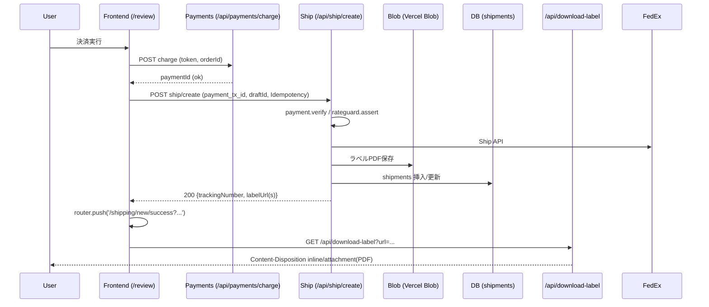
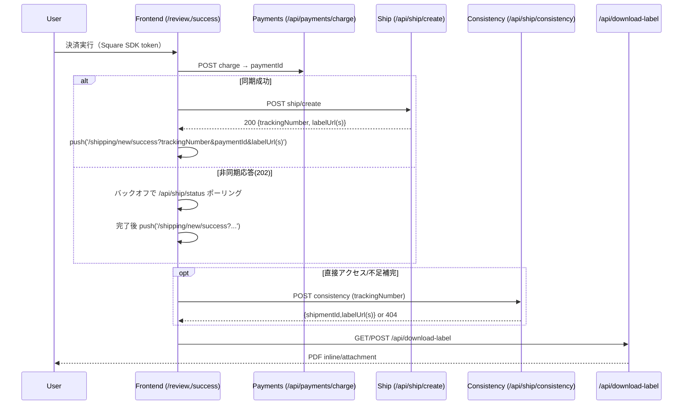

## 成功ゲートと発行・PDF取得の実装調査（2025-10-28）

### 1. 画面 & ルートの全体マップ

- **/shipping/new 配下のステップ**（レイアウト定義）

```1:29:src/app/shipping/new/layout.tsx
// 探索ログ: ステップ配列と完了表示の実装。data-test属性(step{n}-status)を付与。
'use client'
...
const steps = isServiceStepEnabled()
  ? [
      ...baseSteps,
      { id: 5, name: 'サービス別見積', href: '/shipping/new/service' },
      { id: 6, name: '確認画面', href: '/shipping/new/review' },
      { id: 7, name: '完了', href: '/shipping/new/success' }
    ]
  : [
      ...baseSteps,
      { id: 5, name: '確認画面', href: '/shipping/new/review' },
      { id: 6, name: '完了', href: '/shipping/new/success' }
    ]
```

- **成功ページ（CSR）**: `src/app/shipping/new/success/page.tsx`

```1:12:src/app/shipping/new/success/page.tsx
'use client'
...
interface ShipmentResult {
  trackingNumber: string
  labelUrl?: string
  labelUrls?: string[] // MPS用複数ラベル
  paymentId: string
  shipmentId: string
  type?: string // 'standard' | 'mps'
  packageCount?: number
}
```

- 他主要ページ（CSR）例:
  - `src/app/shipping/new/review/page.tsx`（確認+決済→発行トリガ）
  - `src/app/shipping/new/service/page.tsx`（任意のサービス選択）
  - `src/app/shipping/new/contents(/hts)/page.tsx`（内容品/HTS）

レンダリング種別: いずれも `'use client'` 明記で CSR。

### 2. 成功ページ遷移の“実ゲート条件”

- クライアント側で URL クエリから成立判定。以下の論理で `shipmentData` を確定し表示継続。

```150:172:src/app/shipping/new/success/page.tsx
  // 1) URLに十分な情報があれば即確定（shipmentIdが無くてもラベル/追跡番号があれば可）
  if (!shipmentData && trackingNumber && paymentId && (shipmentId || labelUrl || labelUrls.length > 0)) {
    setShipmentData({
      trackingNumber,
      labelUrl: labelUrl ?? undefined,
      labelUrls: labelUrls,
      paymentId,
      shipmentId: shipmentId || 'unknown',
      type: type ?? (packageCount && Number(packageCount) > 1 ? 'mps' : 'standard'),
      packageCount: packageCount ? parseInt(packageCount, 10) : undefined
    })
    return
  }
```

- さらに `shipmentId` が無い場合は、`trackingNumber` があれば整合 API を叩いて補完。

```175:207:src/app/shipping/new/success/page.tsx
  const shouldFetchConsistency = !shipmentData && trackingNumber && !shipmentId
  ...
  const res = await fetch('/api/ship/consistency', { ... body: JSON.stringify({ trackingNumber }) })
  ... setShipmentData({... labelUrl/labelUrls, shipmentId: j.shipmentId || 'unknown' })
```

- 言語化（実ゲート条件）
  - **クライアントのみで成立**。サーバリダイレクトや SSR ガードなし。
  - 必須: `trackingNumber` 且つ `paymentId`。加えて `shipmentId` または `labelUrl` または `labelUrls` のいずれかがあれば即表示。
  - `paymentStatus` の検証は行っていない。`labelId` も不使用（`labelUrl(s)` で代替）。

### 3. 決済フローの実装経路

- 決済トークン取得 UI: `src/components/SquarePaymentForm.tsx`

```59:79:src/components/SquarePaymentForm.tsx
<PaymentForm ... cardTokenizeResponseReceived={cardTokenizeResponseReceived}>
...
  if (onTokenReceived && token.token) { await onTokenReceived(token.token) }
```

- 確認画面での統合処理: `src/app/shipping/new/review/page.tsx`

```273:321:src/app/shipping/new/review/page.tsx
const handleTokenReceived = async (token: string) => {
  ...
  // 1) 決済: /api/payments/charge（idempotent）
  const orderId = `ord-${Date.now()}`
  const chargeRes = await fetch('/api/payments/charge', { method: 'POST', body: JSON.stringify({ orderId, amount: calculations.total, currency: 'JPY', token, locationId: ... }) })
  const chargeJson = await chargeRes.json()
  if (!chargeRes.ok || !chargeJson.ok) throw new Error(...)
  const paymentTxId = String(chargeJson.paymentId)
  // 2) 出荷作成: /api/ship/create（Idempotency-Key ヘッダ・draftId ヘッダ）
  const response = await fetch('/api/ship/create', { method: 'POST', headers: { 'Idempotency-Key': `fql-${orderId}`, ...(draftId?{'x-draft-id':draftId}:{}) }, body: JSON.stringify({ ...shipBody, payment_tx_id: String(chargeJson.paymentId || '') }) })
```

- 決済 API（冪等/状態保存）: `src/app/api/payments/charge/route.ts`

```37:75:src/app/api/payments/charge/route.ts
// 既存の注文にpaymentIdがあれば再利用
if (existing?.square_payment_id) { return NextResponse.json({ ok: true, paymentId: existing.square_payment_id, status: 'PENDING', ... }) }
... // Square SDK 決済 → paymentId/status
await sb.from('shipments').update({ square_payment_id: paymentId, payment_status: status.toLowerCase() }).eq('order_id', orderId)
return NextResponse.json({ ok: true, paymentId, status, ... })
```

- Webhook（署名チェック→DB反映）: `src/app/api/payments/webhook/route.ts`

```23:55:src/app/api/payments/webhook/route.ts
if (!verifySquareSignature(req, text)) return 400
const payment = event?.data?.object?.payment || {}
const paymentId = payment?.id, status = payment?.status, orderId = payment?.orderId ...
const appStatus = toAppStatus(status || '') // completed/pending/failed
if (orderId) sb.from('shipments').update({ payment_status: appStatus }).eq('order_id', orderId)
else sb.from('shipments').update({ payment_status: appStatus }).eq('square_payment_id', paymentId)
```

更新フィールド想定: `shipments.square_payment_id`, `shipments.payment_status`。

### 4. 発行（FedEx Ship）フローの実装経路

- 呼び出し元: 上記 Review ハンドラ → `POST /api/ship/create`

```101:121:src/app/api/ship/create/route.ts
export async function POST(req: NextRequest) {
  return withTrace('api.ship.create', req as any, async ({ requestId }) => {
    ...
    const log = createLogger('ship.create', diagId)
    log.info({ step: 'start', ok: true })
```

- 支払検証/同意/RateGuard/発行/保存:

```147:185:src/app/api/ship/create/route.ts
// 既存送り状の冪等返却 → payment.verify(pid) → 未完了なら 402
```

```227:246:src/app/api/ship/create/route.ts
// ドラフト選択レートの存在検証（x-draft-id）→ 未選択なら 422 SERVICE_UNSELECTED
```

```275:371:src/app/api/ship/create/route.ts
// FedEx Ship呼び出し → label.fetch でPDF取得 → Blob保存（public）
// response: labelUrl（Blob URL）と rawUrls を labelUrls として返す
```

```380:448:src/app/api/ship/create/route.ts
// shipments 挿入（tracking_number, service_type, rate_total, currency, label_blob_url, square_payment_id, payment_status='completed', payment_tx_id, terms_*）
```

- 非同期化パス（202＋ポーリング）:

```451:475:src/app/api/ship/create/route.ts
await markProcessing(...); (async()=>{ const resp = await doShip(); markCompleted/markFailed })();
return NextResponse.json({ status: 'processing', shipmentId, requestId }, { status: 202 })
```

### 5. 送り状PDF取得の実装経路

- UI の印刷/ダウンロード: 成功ページより `/api/download-label` を利用

```370:387:src/app/shipping/new/success/page.tsx
<a href={`/api/download-label?url=${encodeURIComponent(shipmentData.labelUrl)}`} target="_blank">...ラベルをダウンロード</a>
... onClick={() => handlePrintLabel(shipmentData.labelUrl!)} // action=print で inline 表示
```

- 配信エンドポイント: `src/app/api/download-label/route.ts`（Content-Disposition/CORS相当）

```44:75:src/app/api/download-label/route.ts
export async function GET(request: NextRequest) {
  const labelUrl = searchParams.get('url'); const action = searchParams.get('action')
  accessToken = await getFedExAccessToken('JP')
```

```98:121:src/app/app/api/download-label/route.ts
const contentDisposition = action === 'print' ? 'inline' : `attachment; filename="fedex-label-<ts>.pdf"`
return new NextResponse(pdfBuffer, { headers: { 'Content-Type': 'application/pdf', 'Content-Disposition': contentDisposition, ... } })
```

サーバ側認可: 現状は URL 所持者許可（追加認可なし）。Content-Disposition を適切設定済み。

### 6. 監査ログの命名規則と出力地点

- 共通ロガー: `src/lib/observability/logger.ts`（構造化、`ns`, `step`, `ok`, `duration_ms`）

```61:69:src/lib/observability/logger.ts
export function createLogger(ns: string, diagId?: string): Logger { ... }
```

- トレース: `src/lib/trace.ts` → `withTrace('api.ship.create'| 'api.quote' | 'api.ship.status', ...)`

```49:66:src/lib/trace.ts
export async function withTrace(ns: string, req: NextRequest, fn: ...) {
  const log = createLogger(ns, requestId)
  log.info({ step: 'start', ok: true })
  ... log.info({ step: 'end', ok: true, duration_ms })
}
```

- 主要ログ点:
  - 発行系: `ns:"ship.create"` ステップ: `start`, `idempotent.hit`, `payment.verify`, `rateguard.assert`, `fedex.request.shipment`, `label.fetch`, `blob.put.label`, `db.write.shipments`, `done`
  - 見積: `ns:"api.quote"` / `api.quote.mps`（`withTrace`）と `[rates][request]`, `[rates][audit]`
  - PDF配信: コンソールログ（`download-label` 内）
  - 決済UI/レビュー: コンソールログ（`決済トークン受信`, `出荷作成成功`）

根拠（サンプル）:

```102:113:src/app/api/ship/create/route.ts
return withTrace('api.ship.create', ...)
... const log = createLogger('ship.create', diagId)
```

```324:346:src/lib/fedex/auth.ts
console.debug('[rates][request]', { residential: ..., rateRequestType: ... })
```

### 7. 乖離の分析と仮説（事実ベース）

- 事実: 成功ページのゲートは「`trackingNumber` と `paymentId` があり、かつ `shipmentId` または `labelUrl(s)` のどれか」がURL（または整合API）で満たされればレンダリング可能。`paymentStatus` のサーバ検証なし。
- 事実: 決済/発行/PDF配信のサーバログは `withTrace`/構造化ログの実装あり（`ship.create` ほか）。Vercel上で `/api/ship` `/api/labels` `/api/pdf` 等が見当たらないケースは、以下の経路で成功画面到達が可能。

仮説（コード整合的に起こり得る経路）:
  - Review で `response.status===202`（非同期化）→ 早期に success へ遷移させるロジックはないが、`success` を直接開いた／URL共有された場合でも表示成立（`paymentId`+`labelUrl` がクエリに存在）。
  - Review の同期成功時、`successUrl` に `labelUrls` を JSON 文字列で付与しており、ブラウザ履歴からの再訪でも表示可能。
  - `download-label` は FedEx ラベル URL をそのまま GET → inline/attachment 返却。失敗時でも成功ページ自体は表示される。
  - `payment_status` は success で未参照のため、Webhook 未着や pending でも success を表示できる。

具体例（条件ミスマッチ箇所）:
  - if: 成功ページは `paymentStatus` 検証なし → redirect 不要 → 「表示されるが決済未完/発行未完」が起こり得る。
  - if: `labelUrl` クエリが与えられた場合 → DB未保存でも UI は「印刷/ダウンロード」ボタンを描画。
  - if: `trackingNumber` だけあり `shipmentId` 無し → `consistency` で補完を試みるが、404でも UI は待機カードを出し続ける。

### 8. Mermaid シーケンス図

As-Designed（期待）



As-Implemented（現状）



注記: 成功ページの表示は URL パラメータで成立し得るため、サーバ側の `payment_status`/DB保存と独立に見える。

### 9. 追加で見つかったリスク/未配線

- 成功ページのゲートが `paymentStatus` に依存していないため、Webhook 未着や pending でも表示される。
- `labelUrls` は JSON 文字列でクエリに載せる場合があり、長大 URL・エンコード不整合のリスク。
- `/api/download-label` は URL 所持者への配信で追加認可なし（社外共有時の可視性）。
- `ship/create` は `SHIP_API_WRITE_ENABLED !== 'true'` で 503 を返すガードあり。UI 側はこれを明示的にブロックしない。

—

参考コード（相対パス）:
- `src/app/shipping/new/success/page.tsx`
- `src/app/shipping/new/review/page.tsx`
- `src/app/api/payments/charge/route.ts`
- `src/app/api/payments/webhook/route.ts`
- `src/app/api/ship/create/route.ts`
- `src/app/api/ship/status/route.ts`
- `src/app/api/ship/consistency/route.ts`
- `src/app/api/download-label/route.ts`
- `src/lib/observability/logger.ts`, `src/lib/trace.ts`


